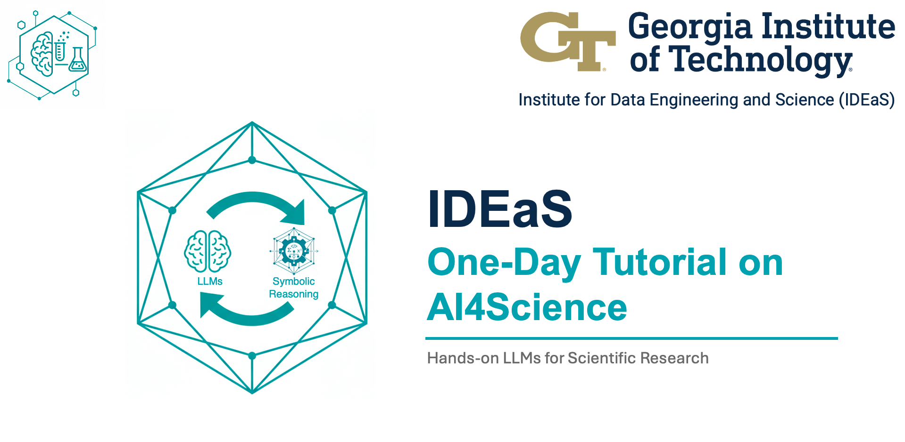

# AI4Science Workshop: Opencode/Gemini-CLI



This repository provides information for both tutorials apart of the IDEaS
One-Day Tutorial on AI4Science. Some general links are provided directly below
for the google colab notebooks and the details for Tutorial 1 with three
separate applications are included below. Note, Tutorial 1 is designed to work
with `gemini-cli` or `opencode` tool (see installation details below).

File Structure

```txt
├── environment.yml # for conda environment
├── equation_implementation # launch vscode in this directory for part 2!
│   ├── GEMINI.md
│   ├── README.md
│   └── schriber_2021_184110.pdf
├── extras
│   └── Header.png
├── qm_mcp # launch vscode in this directory for part 3!
│   ├── GEMINI.md
│   └── README.md
├── README.md
└── scientific_plotting # launch vscode in this directory for part 1!
    ├── combined_df_4569.pkl
    ├── GEMINI.md
    ├── los-ii.pdf
    ├── psi4_output.dat
    └── README.md
```

## General Links

- Workshop [website](https://sites.gatech.edu/ai4science-tutorial/)
- Tutorial 1 Slides (after workshop)
- Tutorial 2 Slides (after workshop): 
    - notebook links (day of workshop)

# Tutorial 1

This tutorial is designed to walk you through 3 separate examples:
1. SI data analysis, plotting, and extensions, [Part 1](#1. Scientific Plotting and Data Extension Example)
2. Test driven development to implement and optimize an equation from literature, [Part 2](### 2. Equation Implementation Example)
3. Creating and connecting an MCP server, [Part 3](### 3. Creating an MCP Server)

## Installation

Create a conda environment for python packages
```py
conda env create -f environment.yml
conda activate p4_qcml
```

To use either [gemini-cli](https://github.com/google-gemini/gemini-cli) or [opencode](https://opencode.ai/), you will need to install npm, which we encourage you to install using Node Version Manager [(nvm)](https://github.com/nvm-sh/nvm?tab=readme-ov-file#installing-and-updating). The following can be used to install nvm and then npm:
```bash
curl -o- https://raw.githubusercontent.com/nvm-sh/nvm/v0.40.3/install.sh | bash
. ~/.bashrc
nvm install --lts
nvm use --lts
```

Then we can install gemini-cli through
```bash
npm install -g @google/gemini-cli
```

Or opencode via
```bash
npm install -g opencode-ai
```


Other installation details can be found at the official gemini-cli page [here](https://github.com/google-gemini/gemini-cli) or opencode page [here](https://opencode.ai/).

### Optional
We recommend installing and using VSCode for these demos to facilitate the
integration between a terminal (can open with ctrl+\` or cmd+\`). When
launching gemini or opencode the first time, allow vscode to install the cli
extension for integrated support to see file changes easier from the models.

## Usage

Each section can be done separately. The procedure will be to change
directories into desired example, like `cd ./scientific_plotting` and follow
the instructions in the `README.md`. Each txt block is meant to be a prompt
that you will use with gemini or opencode models. Since gemini-cli has been
tested the most in creating these tutorials, start with this model and run
through it a first time, but afterwards, go back and try to use another model
from opencode! Different models will give different results with some better
than others. Also, change the prompts to see how that impacts the outcomes. 

### 1. Scientific Plotting and Data Extension Example

Plotting figures is an essential task for scientists, so this example shows how
you can use agentic command line tools to interpret data and plot data to
reproduce literature results. The example specifically highlights reproducing
violin plots from a recent
[work](https://chemrxiv.org/engage/chemrxiv/article-details/67fe885f6e70d6fb2e033804)
comparing levels of symmetry adapted perturbation theory methods in quantum
chemistry. You don't have to understand the chemistry or physics to engage in
this example for it is supposed to be general enough to really stand in for any
data you might encounter.

This agent interprets and plots from data in CSV or PKL files. 

### 2. Equation Implementation Example

This agent reads a scientific paper in PDF format and translates the equations
into Python code using an agentic test-driven development approach

### 3. Creating an MCP Server

Goes through creating and adding an MCP server to gemini-cli

# Opencode Usage

Opencode works very similar to gemini; however, you will want to authenticate with
GitHub Copilot before using it by running
```sh
opencode auth login
```
Then select GitHub Copilot
```txt
┌  Add credential
│
◆  Select provider

│  Search:
│  ○ opencode zen
│  ○ Anthropic
│  ● GitHub Copilot
│  ○ OpenAI
│  ○ Google
│  ○ OpenRouter
│  ○ Vercel AI Gateway
│  ...
│  ↑/↓ to select • Enter: confirm • Type: to search
└
```

Next launch `opencode` that should open a prompt very similar to gemini-cli.
Select a model with a slash command (`/models`) and pressing tab or space to
open a selection for models. I recommend selecting the `Claude Sonnet 4.5
(Preview) GitHub Copilot` model to use one of the best models as of 2025-10-03.
If you get an API error, you likely need to enable the model you selected from
copilot under your GitHub Copilot Settings
[here](https://github.com/settings/copilot/features).

# Acknowledgements
- Austin M. Wallace
- Piyush Jha
- Prithwish Jana
- Isabel (Izzy) Berry
- Jaden Yon
- Jacques Gay
